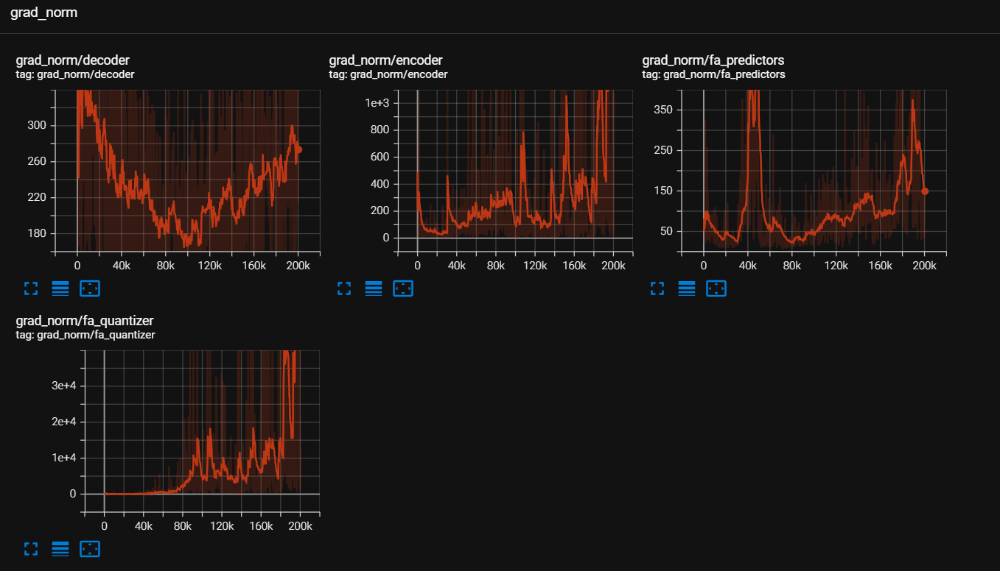
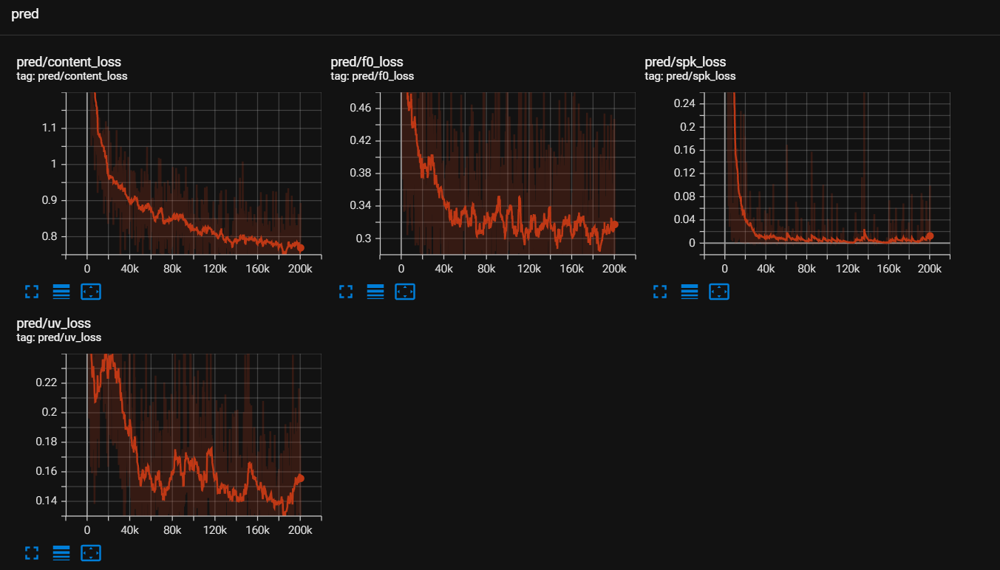
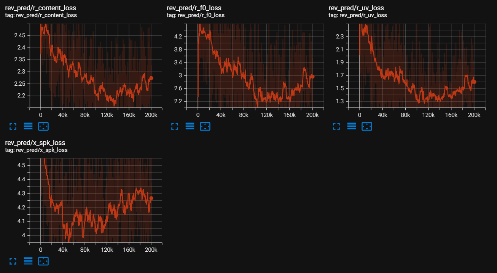
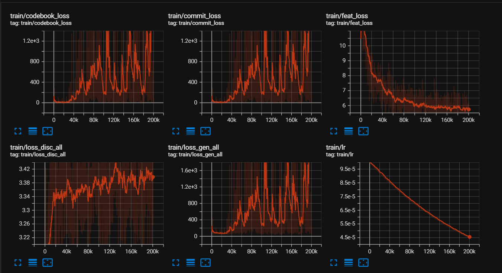
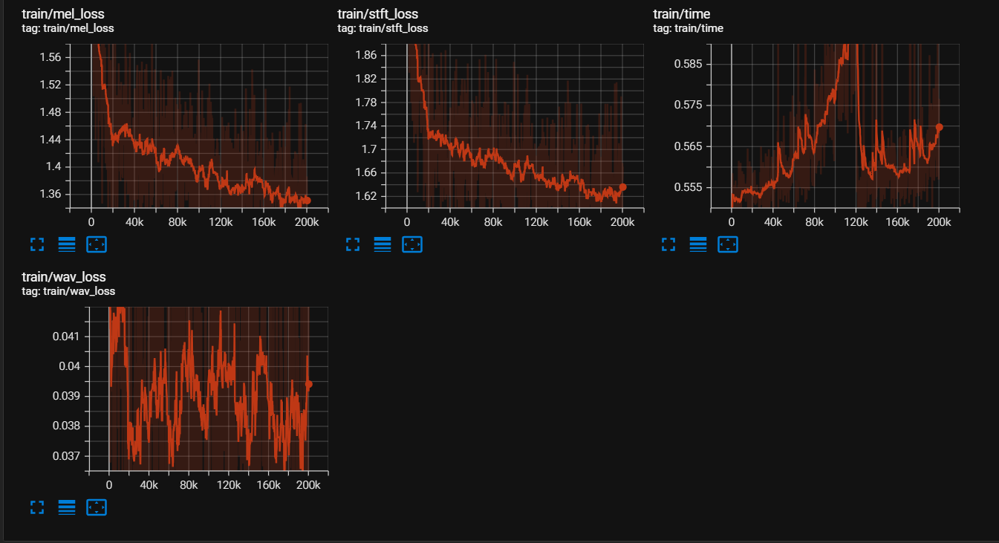

# FAcodec

This repository is a Pytorch implementation for the training of FAcodec, which was proposed in paper [NaturalSpeech 3: Zero-Shot Speech Synthesis
with Factorized Codec and Diffusion Models](https://arxiv.org/pdf/2403.03100)  

Implementation is slightly different from the original paper. While the original version is based on phoneme prediction,
which requires text transcription and phoneme-audio alignment, this implementation is based on predicting semantic latent,
eliminating the need for this difficult part in data preparation (alignment is especially difficult).
<br>
<br>
Current implementation is only experimented with VCTK dataset but it has already demonstrated successful speech reconstruction
and content, timbre & prosody disentanglement abilities.

## Requirements
- Python 3.10

## Dataset
prepare your dataset annotation in a `.txt` file with each line containing:
```
<absolute_path_to_audio>\t<speaker_id>\t<language>\t<transcript>\t<phonemized_transcript>
```
An example of the dataset annotation file is provided in `data/val.txt`. Note that speaker ids, languages or transcripts
can be omitted if you do not have them, they are just placeholders. Only make sure audio paths are correct.  
Put your prepared data under `./data/train.txt` and `./data/val.txt`.
## Training
Download the semantic teacher (currently we are using [SpeechTokenizer](https://github.com/ZhangXInFD/SpeechTokenizer)) 
from [here](https://huggingface.co/fnlp/SpeechTokenizer) and put the checkpoint and config file under `./w2v_models/`.   
Then run the following command:
```
accelerate launch train.py
```
Default tensorboard log directory is `./Models/run/tensorboard`  
You will need at least 100k steps until you observe successful disentanglement.
## Evaluation
Results will be logged to tensorboard. Default tensorboard log directory is `./Models/run/eval/tensorboard`.
```
python eval.py
```
## Inference
(To be implemented)

## Pretrained Models
Currently, training is only implemented with VCTK dataset. Pretrained model's generalization ability is not good but
can demonstrate successful speech reconstruction and disentanglement.   
It will be released soon.

## Appendix: Loss curves during training





